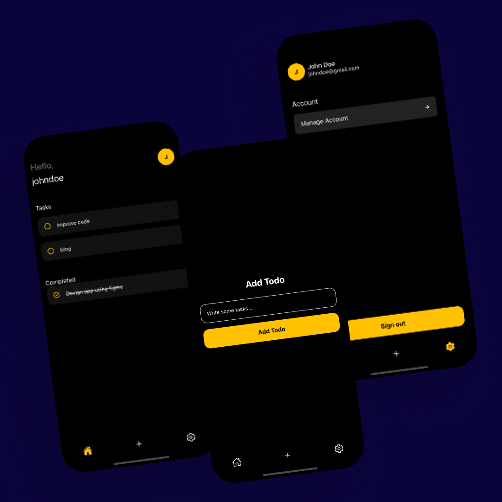

# React Native in 30 Days(version2)

A 30 days challenge to delve deep into React Native using React Native CLI and typescript with other technologies.

## Table of Content

- [About](#about)
- [Screenshots](#screenshots)
- [Technologies](#technologies)
- [Setup](#setup)
- [Folder Structure](#folder-structure)
- [Status](#status)

## About

After learning the basics of React native from [reactnative.dev](https://reactnative.dev) and other learn materials such as videos from youtube, blog articles, stack-overflow, etc, I decided to build a project to validate my skills in the middle of the challenge. I built an MVP version of a Todo app. Putting the skills I have acquired over the past few days, I implemented the following features:

- Authentication (Email and Password) or google sign-in
- CRUD operations: Creating, reading, updating and deleting a todo
- Navigating between screens (Stack and Tab navigation)
- Persist data to a Database service(Firebase Cloud Firestore)

## Screenshots

## Technologies

- React Native CLI
- React Navigation
- Typescript
- Firebase

## Setup

- Clone the project from [Github](https://github.com/victorbruce/reactnative-in-30-v2/)

- Run git clone https://github.com/victorbruce/reactnative-in-30-v2/tree/day-1

- cd [project-name]

- Run `npm install`

- cd pod and run `pod install`

- Run `npx react-native start` in a new terminal

- For macOS users run `npx react-native run-ios`

- For windows users, start AVD(Android Virtual Device) and run `npx react-native run-android`

## Folder Structure
`src`: contains all related code and assets for building the application

  - `assets`: images, icons, videos, logos, etc

  - `components`: contains reusable components that will be used on different parts of the screens of the app. Example: navigation, form inputs, buttons, alerts, etc

  - `config`: contains code that affects parts of the app such as theming, etc.

  - `navigation`: holds all the navigations for the entire app (Stack, Tabs, and Drawer Navigation)

  - `contexts`: contains all the contexts defined for holding global state variables within the app.

  - `screens`: holds individual screens within our app. Example: Home Screen, Settings Screen, etc

  -  `utils`: resuable functions to perform certain tasks within the app
  - `App.tsx`: the entry point of the application

`index.js`: the file to register our entire app component

`app.json`: a file that allows us to configure parts of our application. From changing the name of your app to adding a short description of what your app is about or setting a primary user for publishing and creating builds.

## Status

- Done/Complete
