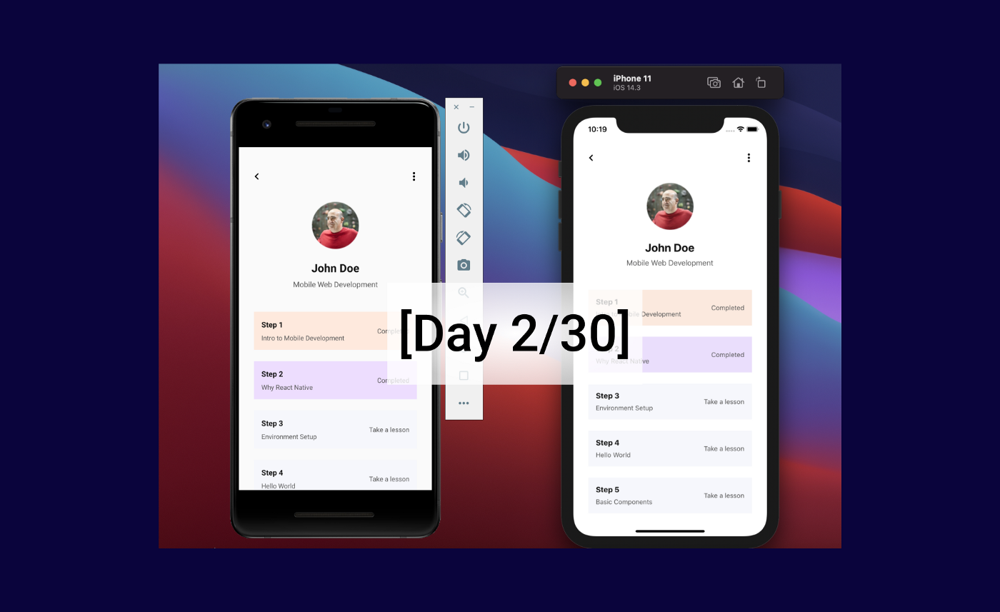

# React Native in 30 Days(version2)

A 30 days challenge to delve deep into React Native using React Native CLI and typescript with other technologies.

## Table of Content

- [About Day 1](#about-day-1)
- [Screenshots](#screenshots)
- [Technologies](#technologies)
- [Setup](#setup)
- [Status](#status)

## About Day 2

Day 2 was fun and I learned a lot. I am hoping to refactor the day 2 code to use the more performant ListView component, FlatList.

## Screenshots

## Technologies

- React Native CLI
- React Native
- Typescript

## Setup

- Clone the project from [Github](https://github.com/victorbruce/reactnative-in-30-v2/tree/day-1)

- Run git clone https://github.com/victorbruce/reactnative-in-30-v2/tree/day-1

- cd [project-name]

- Run `npm install`

- cd pod and run `pod install`

- Run `npx react-native start` in a new terminal

- For macOS users run `npx react-native run-ios`

- For windows users, start AVD(Android Virtual Device) and run `npx react-native run-android`

## Status

- Done/Complete
