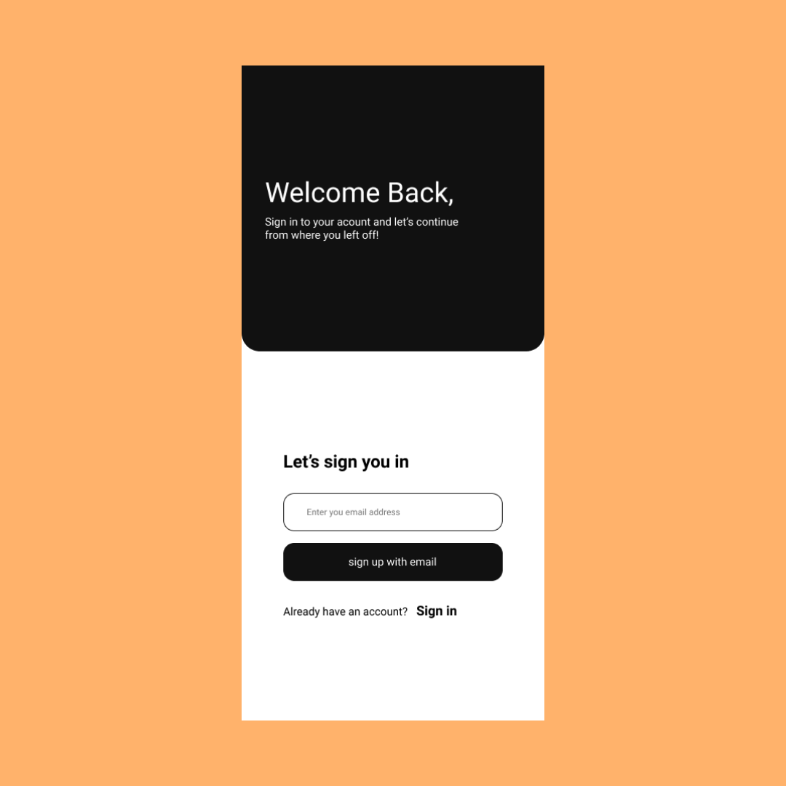
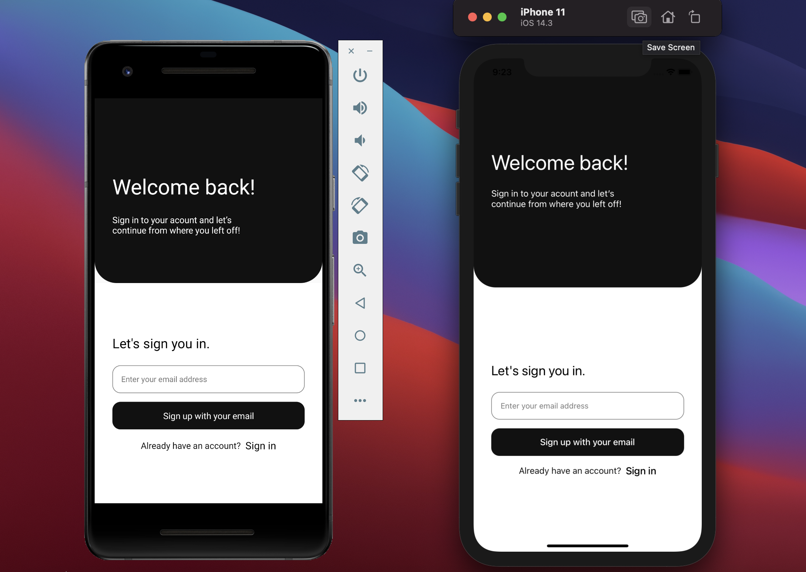

# React Native in 30 Days(version2)

A 30 days challenge to delve deep into React Native using React Native CLI and typescript with other technologies.

## Table of Content

- [About Day 1](#about-day-1)
- [Screenshots](#screenshots)
- [Technologies](#technologies)
- [Setup](#setup)
- [Status](#status)

## About Day 1

I read about the basic components(View, Text, Image, TextInput, ScrollView, and StyleSheet) in React Native from their official documentation and how these components are used to create views for screens on both iOS and Android devices.

I later designed a UI of a mobile login screen in figma and implemented the design in code using React Native.

## Screenshots

**Figma design**

**Final implementation using React Native**

## Technologies

- React Native CLI
- React Native
- Typescript

## Setup

- Clone the project from [Github](https://github.com/victorbruce/reactnative-in-30-v2/tree/day-1)

- Run git clone https://github.com/victorbruce/reactnative-in-30-v2/tree/day-1

- cd [project-name]

- Run `npm install`

- cd pod and run `pod install`

- Run `npx react-native start` in a new terminal

- For macOS users run `npx react-native run-ios`

- For windows users, start AVD(Android Virtual Device) and run `npx react-native run-android`

## Status

- Done/Complete
